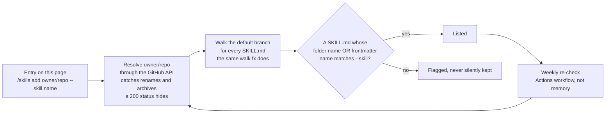

<p align="center">
  <a href="https://awesome.re"></a>
  
  
  
  
  
  
  
</p>

# fx skills, MCP servers, and subagents

**Everything you can plug into [fx](https://fx.sh), the terminal coding agent from Vercel Labs.
Every skill here installs with one `/skills add` line, checked against fx's own resolution rules
every week.**

fx reads `SKILL.md` folders from twelve directories, including `.claude/skills` and
`.agents/skills`, so most of the agent-skill ecosystem already works in it unmodified. It also
speaks MCP with a full OAuth client, runs subagents as child sessions, and embeds as a
WebAssembly module. This list is what that buys you, sorted by the job you are trying to do.

---

## Contents

- [⭐ Featured skill](#-featured-skill)
- [🚀 Where do I start?](#-where-do-i-start)
- [fx skills](#fx-skills)
  - [Design and build interfaces](#design-and-build-interfaces)
  - [Review and refactor code](#review-and-refactor-code)
  - [Test and debug](#test-and-debug)
  - [Databases and auth](#databases-and-auth)
  - [Deploy and run in production](#deploy-and-run-in-production)
  - [Browse the web and gather evidence](#browse-the-web-and-gather-evidence)
  - [Documents, diagrams, and slides](#documents-diagrams-and-slides)
  - [Images, video, and audio](#images-video-and-audio)
  - [Languages and frameworks](#languages-and-frameworks)
  - [Security](#security)
  - [Plan work and manage git](#plan-work-and-manage-git)
  - [Marketing, SEO, and writing](#marketing-seo-and-writing)
  - [Connect the tools you already use](#connect-the-tools-you-already-use)
  - [Subagents and agent teams](#subagents-and-agent-teams)
  - [Build agents, skills, and MCP servers](#build-agents-skills-and-mcp-servers)
- [fx MCP servers](#fx-mcp-servers)
  - [Sign in with OAuth](#sign-in-with-oauth)
  - [No account needed](#no-account-needed)
  - [Run locally over stdio](#run-locally-over-stdio)
  - [Live data APIs](#live-data-apis)
- [Gateways and bridges](#gateways-and-bridges)
- [Ports and packaging](#ports-and-packaging)
- [Embedding fx](#embedding-fx)
- [Good to know](#good-to-know)

<!-- fullcatalog:start -->
- **Full catalog:** every fx skill this list resolves (1073) in [CATALOG.md](CATALOG.md)
<!-- fullcatalog:end -->

---

<!-- stars:start -->

## ⭐ Featured skill

**Search YouTube and pull transcripts** with [youtube-full](https://github.com/ZeroPointRepo/youtube-skills) by [ZeroPointRepo](https://github.com/ZeroPointRepo). Transcripts, video and channel search, playlists, and within-channel search, in one skill. No Google API key, and nothing to install or maintain. 589★.

```sh
/skills add ZeroPointRepo/youtube-skills --skill youtube-full
```

---

## 🚀 Where do I start?

**1. Install fx.** One binary, about 8 MB, no runtime.

```sh
curl -fsSL https://fx.sh/setup.sh | bash
```

**2. Add a skill.** Every entry below follows the same shape, typed inside an fx session:

```sh
/skills add <owner>/<repo> --skill <name>
```

fx clones the repo, finds the matching `SKILL.md`, and copies just that folder into
`~/.fx/skills`. Drop `--skill` to take every skill in the repo. `npx skills add owner/repo` typed
as a shell command works too, and fx installs it itself without running npx.

**3. Pick the one that fixes today.** Not sure? Start with
[systematic-debugging](#test-and-debug) if something is broken, or
[frontend-design](#design-and-build-interfaces) if you are staring at a blank page.

> fx is marked **Experimental** by its own authors and moves fast, five releases in its first five
> days. Re-check a workflow after an upgrade.

---

## fx skills

<!-- catalog:start -->
### Design and build interfaces

- **Give a new UI an actual point of view** with [frontend-design](https://github.com/anthropics/skills) by [anthropics](https://github.com/anthropics). Aesthetic direction, typography, and colour choices that do not read as template output. Anthropic's own. 173.1k★.

  <details>
  <summary>Install</summary>

  ```sh
  /skills add anthropics/skills --skill frontend-design
  ```

  </details>

- **Have your UI reviewed against the Web Interface Guidelines** with [web-design-guidelines](https://github.com/vercel-labs/agent-skills) by [vercel-labs](https://github.com/vercel-labs). Accessibility, focus states, motion, and layout, checked as a pass over the code you just wrote. 30.7k★.

  <details>
  <summary>Install</summary>

  ```sh
  /skills add vercel-labs/agent-skills --skill web-design-guidelines
  ```

  </details>

- **Ship a landing page that does not look generated** with [design-taste-frontend](https://github.com/Leonxlnx/taste-skill) by [Leonxlnx](https://github.com/Leonxlnx). Reads the brief, picks a direction, and holds a line on spacing, type scale, and restraint. 83.5k★, MIT.

  <details>
  <summary>Install</summary>

  ```sh
  /skills add Leonxlnx/taste-skill --skill design-taste-frontend
  ```

  </details>

- **Get the small details that make software feel finished** with [emil-design-eng](https://github.com/emilkowalski/skills) by [emilkowalski](https://github.com/emilkowalski). Emil Kowalski on component polish, animation decisions, and the invisible parts. 34.7k★, MIT.

  <details>
  <summary>Install</summary>

  ```sh
  /skills add emilkowalski/skills --skill emil-design-eng
  ```

  </details>

- **Build gesture and spring motion that feels native** with [apple-design](https://github.com/emilkowalski/skills) by [emilkowalski](https://github.com/emilkowalski). Apple's interface and motion approach translated for the web: drags, swipes, sheets, springs. 34.7k★, MIT.

  <details>
  <summary>Install</summary>

  ```sh
  /skills add emilkowalski/skills --skill apple-design
  ```

  </details>

- **Design dashboards and admin panels properly** with [interface-design](https://github.com/Dammyjay93/interface-design) by [Dammyjay93](https://github.com/Dammyjay93). Craft-first patterns for data tables, settings pages, and dense product surfaces. 5.6k★, MIT.

  <details>
  <summary>Install</summary>

  ```sh
  /skills add Dammyjay93/interface-design --skill interface-design
  ```

  </details>

- **Fix the accessibility bugs already in your markup** with [fixing-accessibility](https://github.com/ibelick/ui-skills) by [ibelick](https://github.com/ibelick). ARIA labels, keyboard traps, focus management, contrast, and form error wiring. 8.0k★, MIT.

  <details>
  <summary>Install</summary>

  ```sh
  /skills add ibelick/ui-skills --skill fixing-accessibility
  ```

  </details>

- **Build custom widgets that keyboards can drive** with [better-accessibility](https://github.com/jakubkrehel/skills) by [jakubkrehel](https://github.com/jakubkrehel). Accessibility engineering for components, not a lint pass over finished HTML. 4.7k★, MIT.

  <details>
  <summary>Install</summary>

  ```sh
  /skills add jakubkrehel/skills --skill better-accessibility
  ```

  </details>

- **Pull a design system out of a website you like** with [extract-design-system](https://github.com/arvindrk/extract-design-system) by [arvindrk](https://github.com/arvindrk). Extracts primitives from a public URL and writes starter token files for your project. 197★, MIT.

  <details>
  <summary>Install</summary>

  ```sh
  /skills add arvindrk/extract-design-system --skill extract-design-system
  ```

  </details>

- **Turn a Stitch project into a DESIGN.md the agent reads** with [design-md](https://github.com/google-labs-code/stitch-skills) by [google-labs-code](https://github.com/google-labs-code). Synthesises a semantic design system file, so later prompts inherit the rules instead of re-arguing them. 8.2k★, Apache-2.0.

  <details>
  <summary>Install</summary>

  ```sh
  /skills add google-labs-code/stitch-skills --skill design-md
  ```

  </details>

- **Build accessible, responsive UI to a production bar** with [frontend-ui-engineering](https://github.com/addyosmani/agent-skills) by [addyosmani](https://github.com/addyosmani). WCAG targets, responsive behaviour, and component structure, from Addy Osmani. 91.6k★, MIT.

  <details>
  <summary>Install</summary>

  ```sh
  /skills add addyosmani/agent-skills --skill frontend-ui-engineering
  ```

  </details>

- **Build with HeroUI v3 components** with [heroui-react](https://github.com/heroui-inc/heroui) by [heroui-inc](https://github.com/heroui-inc). Buttons, modals, forms, and cards on Tailwind v4 and React Aria, installed and wired correctly. 30.5k★, Apache-2.0.

  <details>
  <summary>Install</summary>

  ```sh
  /skills add heroui-inc/heroui --skill heroui-react
  ```

  </details>

### Review and refactor code

- **Review everything since a commit, branch, or merge-base** with [code-review](https://github.com/mattpocock/skills) by [mattpocock](https://github.com/mattpocock). Two axes at once: does it follow the repo's documented standards, and does it match the spec. 244.4k★, MIT.

  <details>
  <summary>Install</summary>

  ```sh
  /skills add mattpocock/skills --skill code-review
  ```

  </details>

- **Get a shared vocabulary for module design** with [codebase-design](https://github.com/mattpocock/skills) by [mattpocock](https://github.com/mattpocock). Where a seam goes, how deep a module should be, and how to name the thing you just built. 244.4k★, MIT.

  <details>
  <summary>Install</summary>

  ```sh
  /skills add mattpocock/skills --skill codebase-design
  ```

  </details>

- **Have the agent review its own work before you see it** with [requesting-code-review](https://github.com/obra/superpowers) by [obra](https://github.com/obra). Runs before a merge or a hand-off and checks the work against what was actually asked for. 280.6k★, MIT.

  <details>
  <summary>Install</summary>

  ```sh
  /skills add obra/superpowers --skill requesting-code-review
  ```

  </details>

- **Push back on review feedback that is wrong** with [receiving-code-review](https://github.com/obra/superpowers) by [obra](https://github.com/obra). Verifies a suggestion technically before implementing it, instead of complying with everything. 280.6k★, MIT.

  <details>
  <summary>Install</summary>

  ```sh
  /skills add obra/superpowers --skill receiving-code-review
  ```

  </details>

- **Run a multi-axis review before merging** with [code-review-and-quality](https://github.com/addyosmani/agent-skills) by [addyosmani](https://github.com/addyosmani). Correctness, readability, tests, and risk, scored separately rather than as one vibe. 91.6k★, MIT.

  <details>
  <summary>Install</summary>

  ```sh
  /skills add addyosmani/agent-skills --skill code-review-and-quality
  ```

  </details>

- **Get an unreasonably strict maintainability review** with [thermo-nuclear-code-quality-review](https://github.com/cursor/plugins) by [cursor](https://github.com/cursor). Hunts giant files, leaky abstractions, and spaghetti conditionals. Use it when you want it to hurt. 6.6k★.

  <details>
  <summary>Install</summary>

  ```sh
  /skills add cursor/plugins --skill thermo-nuclear-code-quality-review
  ```

  </details>

- **Run CodeRabbit review from inside the session** with [code-review](https://github.com/coderabbitai/skills) by [coderabbitai](https://github.com/coderabbitai). Fires on an explicit request, and on its own when the agent thinks a review is due. 164★, MIT.

  <details>
  <summary>Install</summary>

  ```sh
  /skills add coderabbitai/skills --skill code-review
  ```

  </details>

- **Review staged changes or the whole working tree** with [code-reviewer](https://github.com/google-gemini/gemini-cli) by [google-gemini](https://github.com/google-gemini). Google's review skill, works on local diffs as well as a PR. 106.8k★, Apache-2.0.

  <details>
  <summary>Install</summary>

  ```sh
  /skills add google-gemini/gemini-cli --skill code-reviewer
  ```

  </details>

- **Review the current git diff with a senior lens** with [code-review-expert](https://github.com/sanyuan0704/sanyuan-skills) by [sanyuan0704](https://github.com/sanyuan0704). SOLID violations, security risk, and concrete rewrites rather than adjectives. 3.9k★, MIT.

  <details>
  <summary>Install</summary>

  ```sh
  /skills add sanyuan0704/sanyuan-skills --skill code-review-expert
  ```

  </details>

- **Refactor without changing behaviour** with [refactor](https://github.com/github/awesome-copilot) by [github](https://github.com/github). Extract functions, break up god objects, rename honestly, keep the tests green. 38.5k★, MIT.

  <details>
  <summary>Install</summary>

  ```sh
  /skills add github/awesome-copilot --skill refactor
  ```

  </details>

- **Bracket a structural change with verification** with [safe-refactor](https://github.com/JuliusBrussee/caveman) by [JuliusBrussee](https://github.com/JuliusBrussee). Proves behaviour before and after the move, so a "pure refactor" is actually pure. 102.3k★.

  <details>
  <summary>Install</summary>

  ```sh
  /skills add JuliusBrussee/caveman --skill safe-refactor
  ```

  </details>

### Test and debug

- **Stop guessing at bugs** with [systematic-debugging](https://github.com/obra/superpowers) by [obra](https://github.com/obra). Forces a hypothesis and a reproduction before any fix is proposed. The most-installed debugging skill there is. 280.6k★, MIT.

  <details>
  <summary>Install</summary>

  ```sh
  /skills add obra/superpowers --skill systematic-debugging
  ```

  </details>

- **Get to root cause when the build breaks** with [debugging-and-error-recovery](https://github.com/addyosmani/agent-skills) by [addyosmani](https://github.com/addyosmani). A repeatable path from failing test to the actual cause, instead of shotgun edits. 91.6k★, MIT.

  <details>
  <summary>Install</summary>

  ```sh
  /skills add addyosmani/agent-skills --skill debugging-and-error-recovery
  ```

  </details>

- **Chase competing hypotheses at the same time** with [parallel-debugging](https://github.com/wshobson/agents) by [wshobson](https://github.com/wshobson). Splits the investigation, collects evidence per branch, then arbitrates on the root cause. 39.3k★, MIT.

  <details>
  <summary>Install</summary>

  ```sh
  /skills add wshobson/agents --skill parallel-debugging
  ```

  </details>

- **Drive your local app with Playwright** with [webapp-testing](https://github.com/anthropics/skills) by [anthropics](https://github.com/anthropics). Click through the running app, screenshot it, and verify the frontend actually does what you think. 173.1k★.

  <details>
  <summary>Install</summary>

  ```sh
  /skills add anthropics/skills --skill webapp-testing
  ```

  </details>

- **Inspect a real browser over Chrome DevTools MCP** with [browser-testing-with-devtools](https://github.com/addyosmani/agent-skills) by [addyosmani](https://github.com/addyosmani). DOM, network, console, and performance traces from the page as it actually renders. 91.6k★, MIT.

  <details>
  <summary>Install</summary>

  ```sh
  /skills add addyosmani/agent-skills --skill browser-testing-with-devtools
  ```

  </details>

- **Turn a described scenario into a Playwright test** with [playwright-generate-test](https://github.com/github/awesome-copilot) by [github](https://github.com/github). Writes the spec from a plain-language walkthrough using Playwright MCP. 38.5k★, MIT.

  <details>
  <summary>Install</summary>

  ```sh
  /skills add github/awesome-copilot --skill playwright-generate-test
  ```

  </details>

- **Build an end-to-end suite that is not flaky** with [e2e-testing-patterns](https://github.com/wshobson/agents) by [wshobson](https://github.com/wshobson). Playwright and Cypress patterns for suites you will still trust in three months. 39.3k★, MIT.

  <details>
  <summary>Install</summary>

  ```sh
  /skills add wshobson/agents --skill e2e-testing-patterns
  ```

  </details>

- **Write pytest suites that survive refactors** with [python-testing-patterns](https://github.com/wshobson/agents) by [wshobson](https://github.com/wshobson). Fixtures, mocking boundaries, and a TDD loop that fits real projects. 39.3k★, MIT.

  <details>
  <summary>Install</summary>

  ```sh
  /skills add wshobson/agents --skill python-testing-patterns
  ```

  </details>

- **Test JavaScript with Jest, Vitest, and Testing Library** with [javascript-testing-patterns](https://github.com/wshobson/agents) by [wshobson](https://github.com/wshobson). Unit, integration, and mocking strategy without testing implementation details. 39.3k★, MIT.

  <details>
  <summary>Install</summary>

  ```sh
  /skills add wshobson/agents --skill javascript-testing-patterns
  ```

  </details>

- **Verify with VoiceOver, NVDA, and JAWS** with [screen-reader-testing](https://github.com/wshobson/agents) by [wshobson](https://github.com/wshobson). The part of accessibility work an automated audit cannot do for you. 39.3k★, MIT.

  <details>
  <summary>Install</summary>

  ```sh
  /skills add wshobson/agents --skill screen-reader-testing
  ```

  </details>

### Databases and auth

- **Work with Supabase without guessing the API** with [supabase](https://github.com/supabase/agent-skills) by [supabase](https://github.com/supabase). Database, Auth, Edge Functions, Realtime, Storage, and the SSR integrations. Maintained by Supabase. 2.6k★, MIT.

  <details>
  <summary>Install</summary>

  ```sh
  /skills add supabase/agent-skills --skill supabase
  ```

  </details>

- **Get Postgres right before you write the migration** with [supabase-postgres-best-practices](https://github.com/supabase/agent-skills) by [supabase](https://github.com/supabase). Schema, index, and RLS practice for Postgres anywhere, not only on Supabase. 2.6k★, MIT.

  <details>
  <summary>Install</summary>

  ```sh
  /skills add supabase/agent-skills --skill supabase-postgres-best-practices
  ```

  </details>

- **Create and operate a Prisma Postgres database** with [prisma-postgres](https://github.com/prisma/skills) by [prisma](https://github.com/prisma). Console, create-db CLI, and the Management API, from Prisma. 54★, MIT.

  <details>
  <summary>Install</summary>

  ```sh
  /skills add prisma/skills --skill prisma-postgres
  ```

  </details>

- **Write Prisma Client queries correctly** with [prisma-client-api](https://github.com/prisma/skills) by [prisma](https://github.com/prisma). Model queries, filters, operators, and the client methods people usually look up twice. 54★, MIT.

  <details>
  <summary>Install</summary>

  ```sh
  /skills add prisma/skills --skill prisma-client-api
  ```

  </details>

- **Work with Neon Postgres and branching** with [neon-postgres](https://github.com/neondatabase/agent-skills) by [neondatabase](https://github.com/neondatabase). Neon's own guidance for serverless Postgres, branches, and connection handling. 85★, Apache-2.0.

  <details>
  <summary>Install</summary>

  ```sh
  /skills add neondatabase/agent-skills --skill neon-postgres
  ```

  </details>

- **Plan and review MySQL schema and indexes** with [mysql](https://github.com/planetscale/database-skills) by [planetscale](https://github.com/planetscale). InnoDB-aware schema design, query tuning, and transaction behaviour from PlanetScale. 645★, MIT.

  <details>
  <summary>Install</summary>

  ```sh
  /skills add planetscale/database-skills --skill mysql
  ```

  </details>

- **Use the Postgres-only features you are ignoring** with [postgresql-optimization](https://github.com/github/awesome-copilot) by [github](https://github.com/github). JSONB, partial indexes, CTE behaviour, and the planner details that decide query cost. 38.5k★, MIT.

  <details>
  <summary>Install</summary>

  ```sh
  /skills add github/awesome-copilot --skill postgresql-optimization
  ```

  </details>

- **Migrate a live database with zero downtime** with [database-migration](https://github.com/wshobson/agents) by [wshobson](https://github.com/wshobson). Expand-contract sequencing, backfills, and a rollback that actually works. 39.3k★, MIT.

  <details>
  <summary>Install</summary>

  ```sh
  /skills add wshobson/agents --skill database-migration
  ```

  </details>

- **Model, query, and secure Firestore** with [firebase-firestore](https://github.com/firebase/agent-skills) by [firebase](https://github.com/firebase). Data modelling, security rules, indexes, and the SDK wiring, from Firebase. 432★, Apache-2.0.

  <details>
  <summary>Install</summary>

  ```sh
  /skills add firebase/agent-skills --skill firebase-firestore
  ```

  </details>

- **Stop an agent deploying to prod by accident** with [convex-deploy-guard](https://github.com/get-convex/agent-skills) by [get-convex](https://github.com/get-convex). Classifies the target deployment and demands fresh consent before anything touches production. 51★.

  <details>
  <summary>Install</summary>

  ```sh
  /skills add get-convex/agent-skills --skill convex-deploy-guard
  ```

  </details>

- **Wire Clerk auth into Next.js properly** with [clerk-nextjs-patterns](https://github.com/clerk/skills) by [clerk](https://github.com/clerk). Middleware, Server Actions, and caching behaviour, from Clerk. 70★.

  <details>
  <summary>Install</summary>

  ```sh
  /skills add clerk/skills --skill clerk-nextjs-patterns
  ```

  </details>

- **Harden a Better Auth setup** with [better-auth-security-best-practices](https://github.com/better-auth/skills) by [better-auth](https://github.com/better-auth). Rate limits, CSRF, trusted origins, session and cookie flags, OAuth token encryption. 211★.

  <details>
  <summary>Install</summary>

  ```sh
  /skills add better-auth/skills --skill better-auth-security-best-practices
  ```

  </details>

### Deploy and run in production

- **Deploy and get the preview link back** with [deploy-to-vercel](https://github.com/vercel-labs/agent-skills) by [vercel-labs](https://github.com/vercel-labs). "Push this live" as one instruction. Vercel's own deployment skill. 30.7k★.

  <details>
  <summary>Install</summary>

  ```sh
  /skills add vercel-labs/agent-skills --skill deploy-to-vercel
  ```

  </details>

- **Deploy from CI with a token instead of a login** with [vercel-cli-with-tokens](https://github.com/vercel-labs/agent-skills) by [vercel-labs](https://github.com/vercel-labs). Token-based Vercel CLI use for pipelines and headless sessions. 30.7k★.

  <details>
  <summary>Install</summary>

  ```sh
  /skills add vercel-labs/agent-skills --skill vercel-cli-with-tokens
  ```

  </details>

- **Cut what a deployed project costs to run** with [vercel-optimize](https://github.com/vercel-labs/agent-skills) by [vercel-labs](https://github.com/vercel-labs). Pulls real usage and config, then names the specific changes worth making. 30.7k★.

  <details>
  <summary>Install</summary>

  ```sh
  /skills add vercel-labs/agent-skills --skill vercel-optimize
  ```

  </details>

- **Execute an Azure deployment that is already planned** with [azure-deploy](https://github.com/microsoft/azure-skills) by [microsoft](https://github.com/microsoft). Runs the deployment for a project with an existing plan and infrastructure files. 1.4k★, MIT.

  <details>
  <summary>Install</summary>

  ```sh
  /skills add microsoft/azure-skills --skill azure-deploy
  ```

  </details>

- **Stand up a production-ready AKS cluster** with [azure-kubernetes](https://github.com/microsoft/azure-skills) by [microsoft](https://github.com/microsoft). Day-0 checklist, SKU choice, private API server, and the networking decisions up front. 1.4k★, MIT.

  <details>
  <summary>Install</summary>

  ```sh
  /skills add microsoft/azure-skills --skill azure-kubernetes
  ```

  </details>

- **Deploy a Next.js or Angular app with SSR** with [firebase-app-hosting-basics](https://github.com/firebase/agent-skills) by [firebase](https://github.com/firebase). Firebase App Hosting for full-stack apps, not just static output. 432★, Apache-2.0.

  <details>
  <summary>Install</summary>

  ```sh
  /skills add firebase/agent-skills --skill firebase-app-hosting-basics
  ```

  </details>

- **Build stateful agents on Cloudflare Workers** with [agents-sdk](https://github.com/cloudflare/skills) by [cloudflare](https://github.com/cloudflare). Durable workflows, WebSocket apps, scheduled tasks, and MCP servers on the Agents SDK. 2.8k★, Apache-2.0.

  <details>
  <summary>Install</summary>

  ```sh
  /skills add cloudflare/skills --skill agents-sdk
  ```

  </details>

- **Write Terraform HashiCorp would accept** with [terraform-style-guide](https://github.com/hashicorp/agent-skills) by [hashicorp](https://github.com/hashicorp). Official HCL style conventions, applied while the code is being written. 858★, MPL-2.0.

  <details>
  <summary>Install</summary>

  ```sh
  /skills add hashicorp/agent-skills --skill terraform-style-guide
  ```

  </details>

- **Build reusable modules across AWS, Azure, and GCP** with [terraform-module-library](https://github.com/wshobson/agents) by [wshobson](https://github.com/wshobson). Module boundaries, variables, and outputs that survive being used twice. 39.3k★, MIT.

  <details>
  <summary>Install</summary>

  ```sh
  /skills add wshobson/agents --skill terraform-module-library
  ```

  </details>

- **Get a small, correct Dockerfile** with [multi-stage-dockerfile](https://github.com/github/awesome-copilot) by [github](https://github.com/github). Multi-stage builds for any language, with the caching layers in the right order. 38.5k★, MIT.

  <details>
  <summary>Install</summary>

  ```sh
  /skills add github/awesome-copilot --skill multi-stage-dockerfile
  ```

  </details>

- **Write manifests, RBAC, and pod security** with [kubernetes-specialist](https://github.com/Jeffallan/claude-skills) by [Jeffallan](https://github.com/Jeffallan). Deployments, service accounts, and policies for real cluster work. 11.3k★, MIT.

  <details>
  <summary>Install</summary>

  ```sh
  /skills add Jeffallan/claude-skills --skill kubernetes-specialist
  ```

  </details>

- **Design a pipeline with real gates** with [deployment-pipeline-design](https://github.com/wshobson/agents) by [wshobson](https://github.com/wshobson). Multi-stage CI/CD, approvals, security checks, and zero-downtime rollout. 39.3k★, MIT.

  <details>
  <summary>Install</summary>

  ```sh
  /skills add wshobson/agents --skill deployment-pipeline-design
  ```

  </details>

### Browse the web and gather evidence

- **Give the agent a browser it can drive** with [agent-browser](https://github.com/vercel-labs/agent-browser) by [vercel-labs](https://github.com/vercel-labs). Navigate, fill forms, click, screenshot, and extract. Vercel's browser automation CLI for agents. 41.8k★, Apache-2.0.

  <details>
  <summary>Install</summary>

  ```sh
  /skills add vercel-labs/agent-browser --skill agent-browser
  ```

  </details>

- **Scrape and crawl sites from the session** with [firecrawl-agent](https://github.com/firecrawl/cli) by [firecrawl](https://github.com/firecrawl). Firecrawl's own CLI skill for turning pages into clean structured text. 614★.

  <details>
  <summary>Install</summary>

  ```sh
  /skills add firecrawl/cli --skill firecrawl-agent
  ```

  </details>

- **Rebuild a site's design system from evidence** with [firecrawl-website-design-clone](https://github.com/firecrawl/firecrawl-workflows) by [firecrawl](https://github.com/firecrawl). Scrapes the real page, then writes colours, type, spacing, and components into a DESIGN.md. 147★, ISC.

  <details>
  <summary>Install</summary>

  ```sh
  /skills add firecrawl/firecrawl-workflows --skill firecrawl-website-design-clone
  ```

  </details>

- **Audit a site's SEO from a live crawl** with [firecrawl-seo-audit](https://github.com/firecrawl/firecrawl-workflows) by [firecrawl](https://github.com/firecrawl). Metadata, headings, site structure, and keyword gaps against the pages as served. 147★, ISC.

  <details>
  <summary>Install</summary>

  ```sh
  /skills add firecrawl/firecrawl-workflows --skill firecrawl-seo-audit
  ```

  </details>

- **Automate and profile Chrome over MCP** with [chrome-devtools](https://github.com/github/awesome-copilot) by [github](https://github.com/github). Interact with pages, capture screenshots, and read performance traces. 38.5k★, MIT.

  <details>
  <summary>Install</summary>

  ```sh
  /skills add github/awesome-copilot --skill chrome-devtools
  ```

  </details>

- **Use a real browser with a real fingerprint** with [browser-mcp-agent](https://github.com/antibrow/anti-detect-browser-skills) by [antibrow](https://github.com/antibrow). Launch, navigate, click, and extract with a persistent kernel-level device profile. 10★, MIT.

  <details>
  <summary>Install</summary>

  ```sh
  /skills add antibrow/anti-detect-browser-skills --skill browser-mcp-agent
  ```

  </details>

- **Search the web with citations attached** with [tavily-research](https://github.com/tavily-ai/skills) by [tavily-ai](https://github.com/tavily-ai). Tavily's research skill, built for answers you can trace back. 468★, MIT.

  <details>
  <summary>Install</summary>

  ```sh
  /skills add tavily-ai/skills --skill tavily-research
  ```

  </details>

- **Run an exhaustive multi-source investigation** with [parallel-deep-research](https://github.com/parallel-web/parallel-agent-skills) by [parallel-web](https://github.com/parallel-web). Deliberately slow and thorough. Reach for it only when a quick search will not do. 73★, MIT.

  <details>
  <summary>Install</summary>

  ```sh
  /skills add parallel-web/parallel-agent-skills --skill parallel-deep-research
  ```

  </details>

### Documents, diagrams, and slides

- **Read, split, merge, and fill PDFs** with [pdf](https://github.com/anthropics/skills) by [anthropics](https://github.com/anthropics). Text and table extraction, page surgery, and form filling. Anthropic's own. 173.1k★.

  <details>
  <summary>Install</summary>

  ```sh
  /skills add anthropics/skills --skill pdf
  ```

  </details>

- **Work on PDFs where the layout matters** with [pdf](https://github.com/openai/skills) by [openai](https://github.com/openai). Renders pages and checks them visually instead of trusting a text dump. OpenAI's own. 25.3k★.

  <details>
  <summary>Install</summary>

  ```sh
  /skills add openai/skills --skill pdf
  ```

  </details>

- **Pull tables and metadata out of a PDF** with [pdf-extraction](https://github.com/claude-office-skills/skills) by [claude-office-skills](https://github.com/claude-office-skills). pdfplumber under the hood, for the documents that defeat a plain text extract. 430★, MIT.

  <details>
  <summary>Install</summary>

  ```sh
  /skills add claude-office-skills/skills --skill pdf-extraction
  ```

  </details>

- **Build and edit real spreadsheets** with [excel-automation](https://github.com/claude-office-skills/skills) by [claude-office-skills](https://github.com/claude-office-skills). Formulas, formatting, and multi-sheet workbooks rather than a CSV pretending to be one. 430★, MIT.

  <details>
  <summary>Install</summary>

  ```sh
  /skills add claude-office-skills/skills --skill excel-automation
  ```

  </details>

- **Convert a PDF into Word, Markdown, or LaTeX** with [pdf-converter](https://github.com/tanis90/pdf-converter-mineru) by [tanis90](https://github.com/tanis90). MinerU-powered, and it handles scanned pages through OCR. 55★.

  <details>
  <summary>Install</summary>

  ```sh
  /skills add tanis90/pdf-converter-mineru --skill pdf-converter
  ```

  </details>

- **Drive pdftk from the shell** with [pdftk-server](https://github.com/github/awesome-copilot) by [github](https://github.com/github). Merge, split, rotate, encrypt, and stamp, for when a library is overkill. 38.5k★, MIT.

  <details>
  <summary>Install</summary>

  ```sh
  /skills add github/awesome-copilot --skill pdftk-server
  ```

  </details>

- **Create a Google Slides deck and fill it** with [recipe-create-presentation](https://github.com/googleworkspace/cli) by [googleworkspace](https://github.com/googleworkspace). Google's own Workspace CLI skill, one of dozens in the same repo. 30.7k★, Apache-2.0.

  <details>
  <summary>Install</summary>

  ```sh
  /skills add googleworkspace/cli --skill recipe-create-presentation
  ```

  </details>

- **Draw the architecture you just described** with [design-doc-mermaid](https://github.com/SpillwaveSolutions/design-doc-mermaid) by [SpillwaveSolutions](https://github.com/SpillwaveSolutions). Activity, sequence, deployment, and architecture diagrams in Mermaid, from text or from source. 160★.

  <details>
  <summary>Install</summary>

  ```sh
  /skills add SpillwaveSolutions/design-doc-mermaid --skill design-doc-mermaid
  ```

  </details>

- **Get an Excalidraw diagram from a description** with [excalidraw-diagram-generator](https://github.com/github/awesome-copilot) by [github](https://github.com/github). Hand-drawn-style flowcharts and system diagrams you can keep editing. 38.5k★, MIT.

  <details>
  <summary>Install</summary>

  ```sh
  /skills add github/awesome-copilot --skill excalidraw-diagram-generator
  ```

  </details>

### Images, video, and audio

- **Turn a product URL into a launch video** with [product-launch-video](https://github.com/heygen-com/hyperframes) by [heygen-com](https://github.com/heygen-com). Feed it a marketing page, a script, or a brief and get a finished promo. 43.6k★, Apache-2.0.

  <details>
  <summary>Install</summary>

  ```sh
  /skills add heygen-com/hyperframes --skill product-launch-video
  ```

  </details>

- **Turn a pull request into an explainer video** with [pr-to-video](https://github.com/heygen-com/hyperframes) by [heygen-com](https://github.com/heygen-com). Point it at a PR URL and it narrates the change with the diff on screen. 43.6k★, Apache-2.0.

  <details>
  <summary>Install</summary>

  ```sh
  /skills add heygen-com/hyperframes --skill pr-to-video
  ```

  </details>

- **Turn a changelog into a branded clip** with [changelog-video](https://github.com/heygen-com/hyperframes) by [heygen-com](https://github.com/heygen-com). Square, about a minute, voiced, with mock-UI visualisations. 43.6k★, Apache-2.0.

  <details>
  <summary>Install</summary>

  ```sh
  /skills add heygen-com/hyperframes --skill changelog-video
  ```

  </details>

- **Generate video from a prompt** with [ai-video-generation](https://github.com/prime-skills/runcomfy-agent-skills) by [prime-skills](https://github.com/prime-skills). A router across RunComfy's video models, so you describe the shot rather than pick the model. 41★, MIT.

  <details>
  <summary>Install</summary>

  ```sh
  /skills add prime-skills/runcomfy-agent-skills --skill ai-video-generation
  ```

  </details>

- **Generate and edit images from the session** with [ai-image-generation](https://github.com/prime-skills/runcomfy-agent-skills) by [prime-skills](https://github.com/prime-skills). Same router idea for stills: generation, edits, and variants. 41★, MIT.

  <details>
  <summary>Install</summary>

  ```sh
  /skills add prime-skills/runcomfy-agent-skills --skill ai-image-generation
  ```

  </details>

- **Generate images across eleven providers** with [baoyu-image-gen](https://github.com/JimLiu/baoyu-skills) by [JimLiu](https://github.com/JimLiu). GPT Image 2, Google, OpenRouter, DashScope, GLM-Image, MiniMax, Seedream, Replicate, and more behind one skill. 25.6k★, MIT.

  <details>
  <summary>Install</summary>

  ```sh
  /skills add JimLiu/baoyu-skills --skill baoyu-image-gen
  ```

  </details>

- **Make a short video with no API key setup** with [videoagent-video-studio](https://github.com/pexoai/pexo-skills) by [pexoai](https://github.com/pexoai). Text-to-video, image-to-video, and reference-based generation. 776★, MIT.

  <details>
  <summary>Install</summary>

  ```sh
  /skills add pexoai/pexo-skills --skill videoagent-video-studio
  ```

  </details>

- **Make a poster or a print-quality PNG** with [canvas-design](https://github.com/anthropics/skills) by [anthropics](https://github.com/anthropics). Real design philosophy applied to static artwork, output as .png or .pdf. 173.1k★.

  <details>
  <summary>Install</summary>

  ```sh
  /skills add anthropics/skills --skill canvas-design
  ```

  </details>

- **Make a GIF that Slack will actually accept** with [slack-gif-creator](https://github.com/anthropics/skills) by [anthropics](https://github.com/anthropics). Knows the size and dimension limits, and validates before you upload. 173.1k★.

  <details>
  <summary>Install</summary>

  ```sh
  /skills add anthropics/skills --skill slack-gif-creator
  ```

  </details>

- **Batch-process images with ImageMagick** with [image-manipulation-image-magick](https://github.com/github/awesome-copilot) by [github](https://github.com/github). Resize, convert, strip metadata, and run the whole folder. 38.5k★, MIT.

  <details>
  <summary>Install</summary>

  ```sh
  /skills add github/awesome-copilot --skill image-manipulation-image-magick
  ```

  </details>

### Languages and frameworks

- **Write React and Next.js the way Vercel does** with [vercel-react-best-practices](https://github.com/vercel-labs/agent-skills) by [vercel-labs](https://github.com/vercel-labs). Performance guidance from Vercel Engineering, applied while the code is written. 30.7k★.

  <details>
  <summary>Install</summary>

  ```sh
  /skills add vercel-labs/agent-skills --skill vercel-react-best-practices
  ```

  </details>

- **Compose React components that scale** with [vercel-composition-patterns](https://github.com/vercel-labs/agent-skills) by [vercel-labs](https://github.com/vercel-labs). The refactor patterns for when prop drilling has quietly become the architecture. 30.7k★.

  <details>
  <summary>Install</summary>

  ```sh
  /skills add vercel-labs/agent-skills --skill vercel-composition-patterns
  ```

  </details>

- **Build React Native and Expo apps well** with [vercel-react-native-skills](https://github.com/vercel-labs/agent-skills) by [vercel-labs](https://github.com/vercel-labs). Vercel's mobile performance guidance for the same stack. 30.7k★.

  <details>
  <summary>Install</summary>

  ```sh
  /skills add vercel-labs/agent-skills --skill vercel-react-native-skills
  ```

  </details>

- **Master the App Router** with [nextjs-app-router-patterns](https://github.com/wshobson/agents) by [wshobson](https://github.com/wshobson). Server Components, streaming, parallel routes, and the data fetching that goes with them. 39.3k★, MIT.

  <details>
  <summary>Install</summary>

  ```sh
  /skills add wshobson/agents --skill nextjs-app-router-patterns
  ```

  </details>

- **Use the type system on purpose** with [typescript-advanced-types](https://github.com/wshobson/agents) by [wshobson](https://github.com/wshobson). Generics, conditional and mapped types, template literals, and when not to reach for them. 39.3k★, MIT.

  <details>
  <summary>Install</summary>

  ```sh
  /skills add wshobson/agents --skill typescript-advanced-types
  ```

  </details>

- **Set up Python with uv, ruff, and ty** with [modern-python](https://github.com/trailofbits/skills) by [trailofbits](https://github.com/trailofbits). Trail of Bits' modern toolchain, including migrating off pip and Poetry. 6.9k★, CC-BY-SA-4.0.

  <details>
  <summary>Install</summary>

  ```sh
  /skills add trailofbits/skills --skill modern-python
  ```

  </details>

- **Find out why the Python is slow** with [python-performance-optimization](https://github.com/wshobson/agents) by [wshobson](https://github.com/wshobson). cProfile and memory profiling first, optimisation second. 39.3k★, MIT.

  <details>
  <summary>Install</summary>

  ```sh
  /skills add wshobson/agents --skill python-performance-optimization
  ```

  </details>

- **Write Go tests that catch real failures** with [golang-testing](https://github.com/samber/cc-skills-golang) by [samber](https://github.com/samber). Table-driven tests, testify suites, fuzzing, goroutine leak detection, coverage. 3.1k★, MIT.

  <details>
  <summary>Install</summary>

  ```sh
  /skills add samber/cc-skills-golang --skill golang-testing
  ```

  </details>

- **Write idiomatic Go** with [golang-design-patterns](https://github.com/samber/cc-skills-golang) by [samber](https://github.com/samber). Functional options, error cascades, resource lifecycle, graceful shutdown. 3.1k★, MIT.

  <details>
  <summary>Install</summary>

  ```sh
  /skills add samber/cc-skills-golang --skill golang-design-patterns
  ```

  </details>

- **Get async Rust right** with [rust-async-patterns](https://github.com/wshobson/agents) by [wshobson](https://github.com/wshobson). Tokio, async traits, error handling, and the concurrency patterns that compile. 39.3k★, MIT.

  <details>
  <summary>Install</summary>

  ```sh
  /skills add wshobson/agents --skill rust-async-patterns
  ```

  </details>

- **Write Rust to Apollo's handbook** with [rust-best-practices](https://github.com/apollographql/skills) by [apollographql](https://github.com/apollographql). Idiomatic Rust from the team that maintains the Apollo Router. 108★, MIT.

  <details>
  <summary>Install</summary>

  ```sh
  /skills add apollographql/skills --skill rust-best-practices
  ```

  </details>

- **Write SwiftUI that does not re-render everything** with [swiftui-expert-skill](https://github.com/AvdLee/SwiftUI-Agent-Skill) by [AvdLee](https://github.com/AvdLee). State flow with @Observable, view composition, invalidation, and list performance. 3.5k★, MIT.

  <details>
  <summary>Install</summary>

  ```sh
  /skills add AvdLee/SwiftUI-Agent-Skill --skill swiftui-expert-skill
  ```

  </details>

- **Review SwiftUI against modern APIs** with [swiftui-pro](https://github.com/twostraws/SwiftUI-Agent-Skill) by [twostraws](https://github.com/twostraws). Paul Hudson's review skill for maintainability and performance. 4.6k★, MIT.

  <details>
  <summary>Install</summary>

  ```sh
  /skills add twostraws/SwiftUI-Agent-Skill --skill swiftui-pro
  ```

  </details>

- **Fix Swift concurrency errors and migrate to Swift 6** with [swift-concurrency](https://github.com/AvdLee/Swift-Concurrency-Agent-Skill) by [AvdLee](https://github.com/AvdLee). Actors, @MainActor isolation, and moving callbacks to async/await. 1.6k★, MIT.

  <details>
  <summary>Install</summary>

  ```sh
  /skills add AvdLee/Swift-Concurrency-Agent-Skill --skill swift-concurrency
  ```

  </details>

- **Fix FPS, TTI, and bundle size in React Native** with [react-native-best-practices](https://github.com/callstackincubator/agent-skills) by [callstackincubator](https://github.com/callstackincubator). Callstack's performance guidance: re-renders, memory leaks, animations. 1.6k★, MIT.

  <details>
  <summary>Install</summary>

  ```sh
  /skills add callstackincubator/agent-skills --skill react-native-best-practices
  ```

  </details>

- **Test Vue apps with Vitest and Test Utils** with [vue-testing-best-practices](https://github.com/vuejs-ai/skills) by [vuejs-ai](https://github.com/vuejs-ai). Component testing, mocking, and Playwright for the end-to-end layer. 2.8k★, MIT.

  <details>
  <summary>Install</summary>

  ```sh
  /skills add vuejs-ai/skills --skill vue-testing-best-practices
  ```

  </details>

- **Animate React with GSAP correctly** with [gsap-react](https://github.com/greensock/gsap-skills) by [greensock](https://github.com/greensock). The official useGSAP hook, refs, contexts, and cleanup, from GreenSock. 14.8k★, MIT.

  <details>
  <summary>Install</summary>

  ```sh
  /skills add greensock/gsap-skills --skill gsap-react
  ```

  </details>

### Security

- **Get a real vulnerability review of a change** with [security-review](https://github.com/getsentry/skills) by [getsentry](https://github.com/getsentry). Sentry's own security review skill, aimed at the diff rather than the whole repo. 974★, Apache-2.0.

  <details>
  <summary>Install</summary>

  ```sh
  /skills add getsentry/skills --skill security-review
  ```

  </details>

- **Harden anything that takes untrusted input** with [security-and-hardening](https://github.com/addyosmani/agent-skills) by [addyosmani](https://github.com/addyosmani). Input handling, auth, storage, and third-party integrations. 91.6k★, MIT.

  <details>
  <summary>Install</summary>

  ```sh
  /skills add addyosmani/agent-skills --skill security-and-hardening
  ```

  </details>

- **Review security per language and framework** with [security-best-practices](https://github.com/openai/skills) by [openai](https://github.com/openai). OpenAI's own review skill, deliberately opt-in rather than always-on. 25.3k★.

  <details>
  <summary>Install</summary>

  ```sh
  /skills add openai/skills --skill security-best-practices
  ```

  </details>

- **Audit Firestore and Storage rules** with [firebase-security-rules-auditor](https://github.com/firebase/agent-skills) by [firebase](https://github.com/firebase). Privilege escalation, role bypass, create-versus-update gaps, and resource exhaustion. 432★, Apache-2.0.

  <details>
  <summary>Install</summary>

  ```sh
  /skills add firebase/agent-skills --skill firebase-security-rules-auditor
  ```

  </details>

- **Secure an API you are about to ship** with [api-security-best-practices](https://github.com/sickn33/agentic-awesome-skills) by [sickn33](https://github.com/sickn33). AuthN and authZ, validation, rate limiting, and the usual API-specific holes. 45.8k★, MIT.

  <details>
  <summary>Install</summary>

  ```sh
  /skills add sickn33/agentic-awesome-skills --skill api-security-best-practices
  ```

  </details>

- **Lock down a Kubernetes cluster** with [k8s-security-policies](https://github.com/wshobson/agents) by [wshobson](https://github.com/wshobson). NetworkPolicy, pod security, and RBAC written for production rather than a demo. 39.3k★, MIT.

  <details>
  <summary>Install</summary>

  ```sh
  /skills add wshobson/agents --skill k8s-security-policies
  ```

  </details>

- **Write smart contracts that do not get drained** with [solidity-security](https://github.com/wshobson/agents) by [wshobson](https://github.com/wshobson). The common vulnerability classes and the patterns that avoid them. 39.3k★, MIT.

  <details>
  <summary>Install</summary>

  ```sh
  /skills add wshobson/agents --skill solidity-security
  ```

  </details>

- **Get security guidance for a Google Cloud workload** with [google-cloud-waf-security](https://github.com/google/skills) by [google](https://github.com/google). Google's own skill, keyed to the Well-Architected security pillar. 19.2k★, Apache-2.0.

  <details>
  <summary>Install</summary>

  ```sh
  /skills add google/skills --skill google-cloud-waf-security
  ```

  </details>

- **Vet a skill before you install it** with [skill-vetter](https://github.com/UseAI-pro/openclaw-skills-security) by [UseAI-pro](https://github.com/UseAI-pro). Reads a third-party SKILL.md for prompt injection and unsafe instructions first. 71★, MIT.

  <details>
  <summary>Install</summary>

  ```sh
  /skills add UseAI-pro/openclaw-skills-security --skill skill-vetter
  ```

  </details>

### Plan work and manage git

- **Write the spec before any code exists** with [spec-driven-development](https://github.com/addyosmani/agent-skills) by [addyosmani](https://github.com/addyosmani). For a new project or a big feature where the requirements are still a conversation. 91.6k★, MIT.

  <details>
  <summary>Install</summary>

  ```sh
  /skills add addyosmani/agent-skills --skill spec-driven-development
  ```

  </details>

- **Break a spec into ordered, buildable tasks** with [planning-and-task-breakdown](https://github.com/addyosmani/agent-skills) by [addyosmani](https://github.com/addyosmani). For when the work is clear but too large to hold in one turn. 91.6k★, MIT.

  <details>
  <summary>Install</summary>

  ```sh
  /skills add addyosmani/agent-skills --skill planning-and-task-breakdown
  ```

  </details>

- **Keep PRODUCT.md and TECH.md true while you build** with [spec-driven-implementation](https://github.com/warpdotdev/common-skills) by [warpdotdev](https://github.com/warpdotdev). Warp's spec-first loop, where the spec is updated as the implementation moves. 507★, MIT.

  <details>
  <summary>Install</summary>

  ```sh
  /skills add warpdotdev/common-skills --skill spec-driven-implementation
  ```

  </details>

- **Survive a context reset mid-task** with [pi-planning-with-files](https://github.com/OthmanAdi/planning-with-files) by [OthmanAdi](https://github.com/OthmanAdi). Plans live in markdown on disk, so compaction or a crash does not lose the thread. 26.6k★, MIT.

  <details>
  <summary>Install</summary>

  ```sh
  /skills add OthmanAdi/planning-with-files --skill pi-planning-with-files
  ```

  </details>

- **Write a PRD with user stories and acceptance criteria** with [prd](https://github.com/github/awesome-copilot) by [github](https://github.com/github). Executive summary through to the edge cases, in a shape engineers can build from. 38.5k★, MIT.

  <details>
  <summary>Install</summary>

  ```sh
  /skills add github/awesome-copilot --skill prd
  ```

  </details>

- **Work on a feature without touching your workspace** with [using-git-worktrees](https://github.com/obra/superpowers) by [obra](https://github.com/obra). Sets up an isolated worktree before a long change begins. 280.6k★, MIT.

  <details>
  <summary>Install</summary>

  ```sh
  /skills add obra/superpowers --skill using-git-worktrees
  ```

  </details>

- **Block the destructive git commands** with [git-guardrails-claude-code](https://github.com/mattpocock/skills) by [mattpocock](https://github.com/mattpocock). Hooks that refuse push, reset --hard, clean, and branch -D before they run. 244.4k★, MIT.

  <details>
  <summary>Install</summary>

  ```sh
  /skills add mattpocock/skills --skill git-guardrails-claude-code
  ```

  </details>

- **Write conventional commit messages** with [conventional-commit](https://github.com/github/awesome-copilot) by [github](https://github.com/github). Structured analysis of the diff, then a message that matches it. 38.5k★, MIT.

  <details>
  <summary>Install</summary>

  ```sh
  /skills add github/awesome-copilot --skill conventional-commit
  ```

  </details>

- **Stage intelligently and commit** with [git-commit](https://github.com/github/awesome-copilot) by [github](https://github.com/github). Reads the working tree, groups related changes, and writes the message. 38.5k★, MIT.

  <details>
  <summary>Install</summary>

  ```sh
  /skills add github/awesome-copilot --skill git-commit
  ```

  </details>

### Marketing, SEO, and writing

- **Find out why the site is not ranking** with [seo-audit](https://github.com/coreyhaines31/marketingskills) by [coreyhaines31](https://github.com/coreyhaines31). Technical and on-page SEO diagnosis rather than a keyword list. 46.5k★, MIT.

  <details>
  <summary>Install</summary>

  ```sh
  /skills add coreyhaines31/marketingskills --skill seo-audit
  ```

  </details>

- **Build template-driven pages at scale** with [programmatic-seo](https://github.com/coreyhaines31/marketingskills) by [coreyhaines31](https://github.com/coreyhaines31). Directory and comparison page programmes that do not read as doorway spam. 46.5k★, MIT.

  <details>
  <summary>Install</summary>

  ```sh
  /skills add coreyhaines31/marketingskills --skill programmatic-seo
  ```

  </details>

- **Get cited inside AI answers** with [ai-seo](https://github.com/coreyhaines31/marketingskills) by [coreyhaines31](https://github.com/coreyhaines31). AEO and GEO: structuring content so a model quotes you rather than your competitor. 46.5k★, MIT.

  <details>
  <summary>Install</summary>

  ```sh
  /skills add coreyhaines31/marketingskills --skill ai-seo
  ```

  </details>

- **Design an experiment worth running** with [ab-testing](https://github.com/coreyhaines31/marketingskills) by [coreyhaines31](https://github.com/coreyhaines31). Sample size, guardrail metrics, and a stopping rule agreed in advance. 46.5k★, MIT.

  <details>
  <summary>Install</summary>

  ```sh
  /skills add coreyhaines31/marketingskills --skill ab-testing
  ```

  </details>

- **Fix meta tags, structured data, and sitemaps** with [seo](https://github.com/addyosmani/web-quality-skills) by [addyosmani](https://github.com/addyosmani). The mechanical layer of search visibility, done properly. 2.7k★, MIT.

  <details>
  <summary>Install</summary>

  ```sh
  /skills add addyosmani/web-quality-skills --skill seo
  ```

  </details>

- **Optimise for search and for generative engines at once** with [seo-geo](https://github.com/ReScienceLab/opc-skills) by [ReScienceLab](https://github.com/ReScienceLab). One pass covering both classic SERP and AI answer surfaces. 1.7k★, Apache-2.0.

  <details>
  <summary>Install</summary>

  ```sh
  /skills add ReScienceLab/opc-skills --skill seo-geo
  ```

  </details>

- **Have your docs reviewed for voice and tone** with [writing-guidelines](https://github.com/vercel-labs/agent-skills) by [vercel-labs](https://github.com/vercel-labs). Vercel's writing guidelines applied as a review pass over prose. 30.7k★.

  <details>
  <summary>Install</summary>

  ```sh
  /skills add vercel-labs/agent-skills --skill writing-guidelines
  ```

  </details>

- **Write a SKILL.md or AGENTS.md that works** with [writing-for-agents](https://github.com/mattpocock/skills) by [mattpocock](https://github.com/mattpocock). How to write documents whose reader is a model, not a person. 244.4k★, MIT.

  <details>
  <summary>Install</summary>

  ```sh
  /skills add mattpocock/skills --skill writing-for-agents
  ```

  </details>

- **Write the README, runbook, or onboarding guide** with [documentation](https://github.com/anthropics/knowledge-work-plugins) by [anthropics](https://github.com/anthropics). Anthropic's documentation skill for the docs nobody volunteers to write. 23.8k★, Apache-2.0.

  <details>
  <summary>Install</summary>

  ```sh
  /skills add anthropics/knowledge-work-plugins --skill documentation
  ```

  </details>

- **Structure docs with Diataxis** with [documentation-writer](https://github.com/github/awesome-copilot) by [github](https://github.com/github). Tutorial, how-to, reference, and explanation kept as separate jobs. 38.5k★, MIT.

  <details>
  <summary>Install</summary>

  ```sh
  /skills add github/awesome-copilot --skill documentation-writer
  ```

  </details>

### Connect the tools you already use

- **Drive Notion from the command line** with [notion-cli](https://github.com/makenotion/skills) by [makenotion](https://github.com/makenotion). Notion's own `ntn` CLI skill for pages, databases, and workers. 161★, MIT.

  <details>
  <summary>Install</summary>

  ```sh
  /skills add makenotion/skills --skill notion-cli
  ```

  </details>

- **Call the Notion REST API directly** with [notion-api](https://github.com/intellectronica/agent-skills) by [intellectronica](https://github.com/intellectronica). For the operations the CLI does not cover. 290★, CC0-1.0.

  <details>
  <summary>Install</summary>

  ```sh
  /skills add intellectronica/agent-skills --skill notion-api
  ```

  </details>

- **Manage Linear issues from the terminal** with [linear-cli](https://github.com/schpet/linear-cli) by [schpet](https://github.com/schpet). Create, move, and comment on issues without leaving the session. 942★, ISC.

  <details>
  <summary>Install</summary>

  ```sh
  /skills add schpet/linear-cli --skill linear-cli
  ```

  </details>

- **Read and update the Linear issue you are working on** with [orca-linear](https://github.com/stablyai/orca) by [stablyai](https://github.com/stablyai). Reads the linked issue for the current branch and keeps it current. 59.5k★, MIT.

  <details>
  <summary>Install</summary>

  ```sh
  /skills add stablyai/orca --skill orca-linear
  ```

  </details>

- **Wire Linear Release into CI** with [linear-release-setup](https://github.com/linear/linear-release) by [linear](https://github.com/linear). Linear's own skill for generating the pipeline configuration. 64★, MIT.

  <details>
  <summary>Install</summary>

  ```sh
  /skills add linear/linear-release --skill linear-release-setup
  ```

  </details>

- **Create and triage GitHub issues over MCP** with [github-issues](https://github.com/github/awesome-copilot) by [github](https://github.com/github). Bug reports, feature requests, and bulk updates from the session. 38.5k★, MIT.

  <details>
  <summary>Install</summary>

  ```sh
  /skills add github/awesome-copilot --skill github-issues
  ```

  </details>

- **Turn a Gmail thread into a Google Task** with [gws-workflow-email-to-task](https://github.com/googleworkspace/cli) by [googleworkspace](https://github.com/googleworkspace). One of a large set of Workspace recipes in Google's own CLI repo. 30.7k★, Apache-2.0.

  <details>
  <summary>Install</summary>

  ```sh
  /skills add googleworkspace/cli --skill gws-workflow-email-to-task
  ```

  </details>

- **Build HTML email as React components** with [react-email](https://github.com/resend/react-email) by [resend](https://github.com/resend). React Email, from Resend, including the visual editor integration. 19.7k★, MIT.

  <details>
  <summary>Install</summary>

  ```sh
  /skills add resend/react-email --skill react-email
  ```

  </details>

- **Stop your mail landing in spam** with [email-best-practices](https://github.com/resend/email-best-practices) by [resend](https://github.com/resend). SPF, DKIM, DMARC, bounce handling, and the list hygiene part everyone skips. 140★.

  <details>
  <summary>Install</summary>

  ```sh
  /skills add resend/email-best-practices --skill email-best-practices
  ```

  </details>

### Subagents and agent teams

- **Hand independent tasks to child sessions** with [subagent-driven-development](https://github.com/obra/superpowers) by [obra](https://github.com/obra). Executes a plan by delegating the parts that do not share state. 280.6k★, MIT.

  <details>
  <summary>Install</summary>

  ```sh
  /skills add obra/superpowers --skill subagent-driven-development
  ```

  </details>

- **Fan work out when two or more tasks are independent** with [dispatching-parallel-agents](https://github.com/obra/superpowers) by [obra](https://github.com/obra). The decision rule for when parallelism helps, and when it just costs tokens. 280.6k★, MIT.

  <details>
  <summary>Install</summary>

  ```sh
  /skills add obra/superpowers --skill dispatching-parallel-agents
  ```

  </details>

- **Keep the main context clean while investigating** with [research](https://github.com/warpdotdev/common-skills) by [warpdotdev](https://github.com/warpdotdev). Pushes noisy searching into subagents and works from the distilled answer. 507★, MIT.

  <details>
  <summary>Install</summary>

  ```sh
  /skills add warpdotdev/common-skills --skill research
  ```

  </details>

- **Decide how many agents a job needs** with [team-composition-patterns](https://github.com/wshobson/agents) by [wshobson](https://github.com/wshobson). Sizing heuristics and preset team shapes instead of spawning ten and hoping. 39.3k★, MIT.

  <details>
  <summary>Install</summary>

  ```sh
  /skills add wshobson/agents --skill team-composition-patterns
  ```

  </details>

- **Give a team of agents a message discipline** with [team-communication-protocols](https://github.com/wshobson/agents) by [wshobson](https://github.com/wshobson). Message types, plan approval, shutdown, and the anti-patterns to avoid. 39.3k★, MIT.

  <details>
  <summary>Install</summary>

  ```sh
  /skills add wshobson/agents --skill team-communication-protocols
  ```

  </details>

- **Design durable multi-step workflows** with [workflow-orchestration-patterns](https://github.com/wshobson/agents) by [wshobson](https://github.com/wshobson). Temporal-style separation of workflow and activity, sagas, and deterministic state. 39.3k★, MIT.

  <details>
  <summary>Install</summary>

  ```sh
  /skills add wshobson/agents --skill workflow-orchestration-patterns
  ```

  </details>

### Build agents, skills, and MCP servers

- **Build an MCP server that models can actually use** with [mcp-builder](https://github.com/anthropics/skills) by [anthropics](https://github.com/anthropics). Tool design, schemas, and error surfaces, from Anthropic. 173.1k★.

  <details>
  <summary>Install</summary>

  ```sh
  /skills add anthropics/skills --skill mcp-builder
  ```

  </details>

- **Build and debug TypeScript MCP servers** with [mcp-apps-builder](https://github.com/mcp-use/mcp-use) by [mcp-use](https://github.com/mcp-use). Tools, resources, prompts, middleware, and auth with mcp-use. 10.6k★, MIT.

  <details>
  <summary>Install</summary>

  ```sh
  /skills add mcp-use/mcp-use --skill mcp-apps-builder
  ```

  </details>

- **Scaffold a TypeScript MCP server** with [typescript-mcp-server-generator](https://github.com/github/awesome-copilot) by [github](https://github.com/github). A complete project on the official SDK, not a snippet. 38.5k★, MIT.

  <details>
  <summary>Install</summary>

  ```sh
  /skills add github/awesome-copilot --skill typescript-mcp-server-generator
  ```

  </details>

- **Scaffold a Python MCP server** with [python-mcp-server-generator](https://github.com/github/awesome-copilot) by [github](https://github.com/github). Same shape, Python SDK. 38.5k★, MIT.

  <details>
  <summary>Install</summary>

  ```sh
  /skills add github/awesome-copilot --skill python-mcp-server-generator
  ```

  </details>

- **Scaffold a Rust MCP server** with [rust-mcp-server-generator](https://github.com/github/awesome-copilot) by [github](https://github.com/github). Tools, prompts, resources, and tests on the official rmcp SDK. 38.5k★, MIT.

  <details>
  <summary>Install</summary>

  ```sh
  /skills add github/awesome-copilot --skill rust-mcp-server-generator
  ```

  </details>

- **Start an agent project with Google's ADK** with [google-agents-cli-scaffold](https://github.com/google/agents-cli) by [google](https://github.com/google). Project scaffold, with sibling skills for eval, deploy, and observability. 5.8k★, Apache-2.0.

  <details>
  <summary>Install</summary>

  ```sh
  /skills add google/agents-cli --skill google-agents-cli-scaffold
  ```

  </details>

- **Give the agent memory between sessions** with [agentmemory-mcp-tools](https://github.com/rohitg00/agentmemory) by [rohitg00](https://github.com/rohitg00). A map of every agentmemory tool and when to call which one. 27.9k★, Apache-2.0.

  <details>
  <summary>Install</summary>

  ```sh
  /skills add rohitg00/agentmemory --skill agentmemory-mcp-tools
  ```

  </details>

<!-- catalog:end -->

---

## fx MCP servers

fx ships a full MCP client: Streamable HTTP, SSE, and stdio, with OAuth 2.1 including PKCE,
dynamic client registration, and refresh. Remote servers are hand-added to `~/.fx/mcp.json`, then
`/mcp reload`. A literal `Authorization` header is refused by design, so a static key always goes
through an environment variable.

<details>
<summary><strong>The two config shapes, once</strong></summary>

Delegated sign-in, no key to handle. Add the block, `/mcp reload`, then `/mcp auth <name> --open`:

```json
{
  "mcp": {
    "linear": {
      "type": "http",
      "url": "https://mcp.linear.app/mcp"
    }
  }
}
```

Static key. Export it in your shell before starting fx; it never touches the file:

```json
{
  "mcp": {
    "example": {
      "type": "http",
      "url": "https://mcp.example.com/mcp",
      "bearer_token_env": "EXAMPLE_API_KEY"
    }
  }
}
```

A local stdio server uses `"type": "local"` and an array command:

```json
{
  "mcp": {
    "playwright": {
      "type": "local",
      "command": ["npx", "-y", "@playwright/mcp@latest"]
    }
  }
}
```

</details>

### Sign in with OAuth

Every server here answered an MCP `initialize` with a proper RFC 9728 challenge, which is exactly
the chain fx walks. Add the URL, `/mcp reload`, `/mcp auth <name> --open`.

- **[GitHub](https://github.com/github/github-mcp-server)**. Repos, issues, pull requests, code
  search, and Actions. `https://api.githubcopilot.com/mcp/`
- **[Linear](https://linear.app/docs/mcp)**. Issues, projects, cycles, and comments.
  `https://mcp.linear.app/mcp`
- **[Notion](https://developers.notion.com/docs/mcp)**. Pages, databases, and search across a
  workspace. `https://mcp.notion.com/mcp`
- **[Sentry](https://docs.sentry.io/product/sentry-mcp/)**. Issues, events, and release health,
  plus Seer for root-cause analysis. `https://mcp.sentry.dev/mcp`
- **[Supabase](https://supabase.com/docs/guides/getting-started/mcp)**. Projects, tables,
  migrations, logs, and Edge Functions. `https://mcp.supabase.com/mcp`
- **[Neon](https://neon.com/docs/ai/neon-mcp-server)**. Postgres projects, branches, and SQL
  against a branch. `https://mcp.neon.tech/mcp`
- **[Vercel](https://vercel.com/docs/mcp/vercel-mcp)**. Projects, deployments, logs, and
  environment variables. `https://mcp.vercel.com`
- **[Cloudflare Workers Bindings](https://developers.cloudflare.com/agents/model-context-protocol/mcp-servers-for-cloudflare/)**. Create and inspect KV, R2, D1, and Workers from the session.
  `https://bindings.mcp.cloudflare.com/mcp`
- **[Stripe](https://docs.stripe.com/mcp)**. Customers, products, prices, invoices, and payment
  links. `https://mcp.stripe.com`
- **[Atlassian](https://support.atlassian.com/rovo/docs/getting-started-with-the-atlassian-remote-mcp-server/)**. Jira issues and Confluence pages. `https://mcp.atlassian.com/v1/sse`
- **[Asana](https://developers.asana.com/docs/using-asanas-mcp-server)**. Tasks, projects, and
  portfolios. `https://mcp.asana.com/sse`
- **[Canva](https://www.canva.dev/docs/apps/mcp-server/)**. Designs, brand assets, and exports.
  `https://mcp.canva.com/mcp`
- **[Intercom](https://developers.intercom.com/docs/guides/mcp)**. Conversations, contacts, and
  help-centre articles. `https://mcp.intercom.com/mcp`
- **[PayPal](https://www.paypal.ai/)**. Invoices, orders, subscriptions, and disputes.
  `https://mcp.paypal.com/mcp`
- **[Square](https://developer.squareup.com/docs/mcp)**. Catalog, orders, payments, and
  customers. `https://mcp.squareup.com/sse`
- **[Webflow](https://developers.webflow.com/data/docs/ai-tools)**. Sites, collections, and CMS
  items. `https://mcp.webflow.com/sse`
- **[Wix](https://dev.wix.com/docs/overview/ai-the-wix-platform/the-wix-mcp)**. Site content, stores, and bookings.
  `https://mcp.wix.com/sse`
- **[Apify](https://docs.apify.com/platform/integrations/mcp)**. Five thousand scrapers as tools,
  and it takes a static token too. `https://mcp.apify.com`
- **[Globalping](https://globalping.io/)**. Ping, traceroute, DNS, and HTTP checks from a global
  probe network. `https://mcp.globalping.dev/sse`

### No account needed

These answer an unauthenticated `initialize`. Add the URL and `/mcp reload`, nothing else.

- **[Context7](https://context7.com/)**. Version-correct documentation and code examples for
  thousands of libraries, fetched at the moment the model needs them.
  `https://mcp.context7.com/mcp`
- **[DeepWiki](https://deepwiki.com/)**. Ask questions about any public GitHub repository and get
  answers grounded in its actual source. `https://mcp.deepwiki.com/mcp`
- **[grep.app](https://grep.app/)**. Regex search across millions of public repositories, from
  Vercel. `https://mcp.grep.app`
- **[Cloudflare Docs](https://developers.cloudflare.com/agents/model-context-protocol/mcp-servers-for-cloudflare/)**. Search Cloudflare's documentation without leaving the terminal.
  `https://docs.mcp.cloudflare.com/mcp`
- **[Hugging Face](https://huggingface.co/settings/mcp)**. Search models, datasets, spaces, and
  papers. Anonymous works; a token raises the limits. `https://huggingface.co/mcp`
- **[Exa](https://docs.exa.ai/reference/exa-mcp)**. Neural web search built for agents.
  `https://mcp.exa.ai/mcp`

### Run locally over stdio

```json
{
  "mcp": {
    "chrome-devtools": {
      "type": "local",
      "command": ["npx", "-y", "chrome-devtools-mcp@latest"]
    }
  }
}
```

- **[Chrome DevTools](https://github.com/ChromeDevTools/chrome-devtools-mcp)**. Drive a real
  Chrome, read the DOM and console, capture performance traces.
  `npx -y chrome-devtools-mcp@latest`
- **[Playwright](https://github.com/microsoft/playwright-mcp)**. Browser automation over the
  accessibility tree rather than screenshots. `npx -y @playwright/mcp@latest`
- **[Filesystem](https://github.com/modelcontextprotocol/servers/tree/main/src/filesystem)**. Scoped read and write outside the workspace fx already sees.
  `npx -y @modelcontextprotocol/server-filesystem /path`
- **[Memory](https://github.com/modelcontextprotocol/servers/tree/main/src/memory)**. A knowledge
  graph that persists across sessions. `npx -y @modelcontextprotocol/server-memory`
- **[Sequential Thinking](https://github.com/modelcontextprotocol/servers/tree/main/src/sequentialthinking)**. A structured scratchpad for problems that need steps.
  `npx -y @modelcontextprotocol/server-sequential-thinking`
- **[Git](https://github.com/modelcontextprotocol/servers/tree/main/src/git)**. Read, search, and
  manipulate a repository as tools rather than shell calls.
  `uvx mcp-server-git --repository /path`

### Live data APIs

- **Search YouTube and pull transcripts** with
  [transcriptapi](https://github.com/ZeroPointRepo/youtube-mcp) by
  [ZeroPointRepo](https://github.com/ZeroPointRepo). Transcripts, search, channels, and playlists.
  Free tier, no Google API key.

  <details>
  <summary>Config</summary>

  ```json
  {
    "mcp": {
      "transcriptapi": {
        "type": "http",
        "url": "https://transcriptapi.com/mcp",
        "bearer_token_env": "TRANSCRIPTAPI_KEY"
      }
    }
  }
  ```

  `export TRANSCRIPTAPI_KEY=...` before starting fx, then `/mcp reload`. Get a key at
  [transcriptapi.com](https://transcriptapi.com). It also answers an OAuth challenge, so
  `/mcp auth transcriptapi --open` works instead if you would rather not hold a key.
  </details>

- **Look up US property data** with
  [zillapi](https://github.com/ZeroPointRepo/zillow-mcp) by
  [ZeroPointRepo](https://github.com/ZeroPointRepo). Listings, valuations, and property search.
  Free tier available.

  <details>
  <summary>Config</summary>

  ```json
  {
    "mcp": {
      "zillapi": {
        "type": "http",
        "url": "https://api.zillapi.com/mcp",
        "bearer_token_env": "ZILLAPI_API_KEY"
      }
    }
  }
  ```

  `export ZILLAPI_API_KEY=...` before starting fx, then `/mcp reload`. Get a key at
  [zillapi.com](https://zillapi.com).
  </details>

---

## Gateways and bridges

fx talks to Vercel AI Gateway, an OpenAI or ChatGPT subscription, or an xAI Grok subscription.
Pointing it at anything else (llama.cpp, Ollama, vLLM, LM Studio, OpenRouter, LiteLLM) is the
single most-solved problem in this ecosystem, by five separate people in under two weeks. Here is
all of it in one place.

- **[fx-any](https://github.com/redstar-systems/fx-any)** by
  [redstar-systems](https://github.com/redstar-systems). A ~230-line shim in front of the stock
  binary, using fx's own loopback gateway override. Survives `fx upgrade` because nothing is
  patched. Proven end to end against a local llama.cpp model, tool calls included. Apache-2.0.

- **[fx-bridge](https://github.com/elijah7x/fx-bridge)** by
  [elijah7x](https://github.com/elijah7x). Python standard library only, no dependencies,
  loopback-only listener, HTTPS-only upstreams, explicit model mapping, and fail-closed routing.
  Ships a smoke test to run after every fx upgrade. Apache-2.0.

- **[fx-lan](https://github.com/agent2x0r/fx-lan)** by
  [agent2x0r](https://github.com/agent2x0r). One compiled Go binary that starts the local gateway
  and launches the real `fx` CLI for you. No runtime libraries. MIT.

- **[fx-openai](https://github.com/iamdemetris/fx-openai)** by
  [iamdemetris](https://github.com/iamdemetris). The fork rather than the shim: `OPENAI_API_KEY`
  and `FX_OPENAI_BASE_URL` are read natively, so there is no proxy in the path. You give up
  tracking upstream. Apache-2.0.

- **[fx-gateway-proxy](https://github.com/Xeron2000/fx-gateway-proxy)** by
  [Xeron2000](https://github.com/Xeron2000). Comes at it from the other end: an
  OpenAI-compatible reverse proxy over Vercel AI Gateway's free GLM pool, with multi-key routing,
  learned capacity ceilings, and cooldown rotation. MIT. **Archived by its author on 2026-08-29** —
  it still runs, but expect no fixes, and prefer one of the four above if you are starting fresh.

---

## Ports and packaging

- **[fx-windows](https://github.com/eng2007/fx-windows)** by
  [eng2007](https://github.com/eng2007). Native x86_64-windows build through a compatibility
  layer, for the platform the official binary does not cover. Apache-2.0.

- **[fxrs](https://github.com/Leeeon233/fx-rs)** by [Leeeon233](https://github.com/Leeeon233). A
  compact Rust rewrite with a full-screen TUI and an ACP stdio server. The TUI is itself an ACP
  client, so editor integration and interactive use share one code path. Apache-2.0.

- **[xfx](https://github.com/2lab-ai/xfx)** by [2lab-ai](https://github.com/2lab-ai). A Rust port
  of the load-bearing agent loop, with a parity ledger and CI that fails if the binary advertises
  anything the ledger does not record as implemented. Different binary name and profile home, so
  it cannot shadow an upstream install. Apache-2.0.

- **[fx-ruby](https://github.com/jagenaujagenau/fx-ruby)** by
  [jagenaujagenau](https://github.com/jagenaujagenau). Ruby standard library only, zero gems,
  carrying over the system prompt, tool contracts, permission model, and session format.
  Apache-2.0.

- **[homebrew-fx](https://github.com/Temikus/homebrew-fx)** by
  [Temikus](https://github.com/Temikus). `brew install temikus/fx/fx`. Note the name clash:
  homebrew-core's `fx` is the JSON viewer, and only one can own the binary name.

- **[fx-sandbox](https://github.com/da-beda/fx-sandbox)** by
  [da-beda](https://github.com/da-beda). `fxs` runs the unmodified upstream binary inside a
  read-only container with all capabilities dropped, no Docker socket, and per-project state. It
  exits rather than silently falling back to native fx. MIT.

- **[fx-sbx-kit](https://github.com/shelajev/fx-sbx-kit)** by
  [shelajev](https://github.com/shelajev). A Docker Sandboxes kit, one `sbx run --kit` away, with
  host-managed Vercel OAuth or a gateway key.

- **[faku](https://github.com/keejkrej/faku)** by [keejkrej](https://github.com/keejkrej). A
  native Zig desktop window for coding agents, fx-first, Waku-protocol compatible.

- **[vercel-fx-cn](https://github.com/bbylw/vercel-fx-cn)** by
  [bbylw](https://github.com/bbylw). The documentation in Chinese.

---

## Embedding fx

- **[WebAssembly SDK](https://fx.sh/docs/lib/webassembly)**. Official. `createFxAgent` for
  headless ACP and `createFxTerminal` for the real TUI, both from
  [`sdk/`](https://github.com/vercel-labs/fx/tree/main/sdk) in the fx repo. Needs JSPI, so
  Chrome or Edge 137+.

- **[ACP server](https://fx.sh/docs/using-fx/acp)**. Official. `fx acp` speaks the Agent
  Client Protocol over stdio, which is how an editor drives fx as its backend.

- **[chrome-fx](https://github.com/Lakphy/chrome-fx)** by [Lakphy](https://github.com/Lakphy). The
  official WASM terminal injected as a Chrome overlay, with `browser` and `js` commands so the
  agent drives the page you are looking at.

- **[fx-on-workers](https://github.com/codingstark-dev/fx-on-workers)** by
  [codingstark-dev](https://github.com/codingstark-dev). fx inside a Cloudflare Worker, one
  Durable Object per session holding a live wasm instance, TUI streamed over a WebSocket into
  xterm.js.

- **[fx-in-a-tab](https://github.com/YuktiKholiwal/fx-in-a-tab)** by
  [YuktiKholiwal](https://github.com/YuktiKholiwal). fx compiled to WebAssembly driving
  just-bash, with a real directory mounted read-only from your disk.

- **[fx-review-action](https://github.com/TommyBez/fx-review-action)** by
  [TommyBez](https://github.com/TommyBez). AI review on every pull request. Validates each finding
  against the diff before posting, so hallucinated line numbers never reach the PR, and never
  blocks a merge. Use `uses: TommyBez/fx-review-action@v0`. The README still names an older
  account and a tag that does not exist.

- **[fx-inside-function](https://github.com/NicolasMontone/fx-inside-function)** by
  [NicolasMontone](https://github.com/NicolasMontone). fx running inside a serverless function,
  the smallest demonstration of the embedding story.

---

## Good to know

<details>
<summary><strong>How every entry is checked</strong></summary>

Every skill on this page is re-checked weekly against the rule fx itself applies when it installs
one, not against a link status.



That is a real workflow in this repo
([`verify-skills.yml`](.github/workflows/verify-skills.yml)). It runs every Monday, and the two
badges at the top of this page are written by that run. Neither is a hand-set claim: the workflow
overwrites [`badges/verified.json`](badges/verified.json) every time, and the badge displays that
file.

The match rule is taken from fx's own installer, which filters a cloned repository by folder name
**or** by the `name:` in the `SKILL.md` frontmatter. A checker that only looked for the folder
would report working entries as broken.

</details>

<details>
<summary><strong>🛡️ Security notice</strong></summary>

This is a **curated list, not a security audit**. A skill is a folder of instructions your agent
will follow, and an MCP server is a process or endpoint acting with whatever authority you hand
it. Both can read your files, spend your credits, and reach the network. A skill's presence here
means it installs and the project is real and active as of its last check, not that its contents
have been reviewed.

Read a `SKILL.md` before you install it, the same as you would a browser extension. Keep
`~/.fx/mcp.json` private, and use narrowly scoped tokens.

Found something malicious rather than merely broken? Open an issue and say so plainly, or use
GitHub's private vulnerability reporting on the project's own repo.

</details>

<details>
<summary><strong>🤝 Contributing</strong></summary>

PRs are very welcome. [CONTRIBUTING.md](CONTRIBUTING.md) has the format and the acceptance rules.

</details>

<details>
<summary><strong>Related lists</strong></summary>

- **[awesome-hermes-skills](https://github.com/ZeroPointRepo/awesome-hermes-skills)**. Skills,
  plugins, memory providers, and surfaces for Nous Research's Hermes Agent.
- **[awesome-dsh-plugins](https://github.com/ZeroPointRepo/awesome-dsh-plugins)**. Verified
  DeepSeek Harness plugins, organised by the job they do.
- **[awesome-agent-plugins](https://github.com/ZeroPointRepo/awesome-agent-plugins)**. The
  vendor-neutral Agent Plugins standard, and who actually complies with it.
- **[awesome-cursor-plugins](https://github.com/ZeroPointRepo/awesome-cursor-plugins)**. Cursor plugins from the official marketplace, each with the other agents it also runs in and whether it needs a sign-in.
- **[awesome-grok-bot](https://github.com/ZeroPointRepo/awesome-grok-bot)**. Skills, plugins, and
  MCP servers for Grok Bot.

</details>

---

<p align="center">
Maintained by <a href="https://github.com/ZeroPointRepo">ZeroPointRepo</a> · list content licensed
<a href="https://creativecommons.org/licenses/by/4.0/">CC BY 4.0</a> · Built with
<a href="https://crhq.ai">crhq.ai</a>
<br />
<sub>Unofficial, community-maintained. Not affiliated with or endorsed by Vercel or Vercel Labs.</sub>
</p>

<!-- stars:end -->
